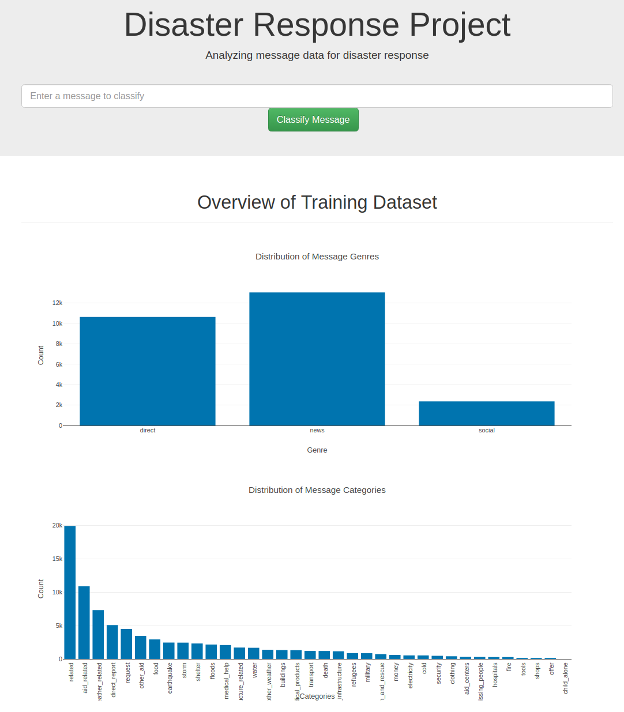
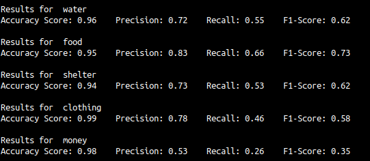
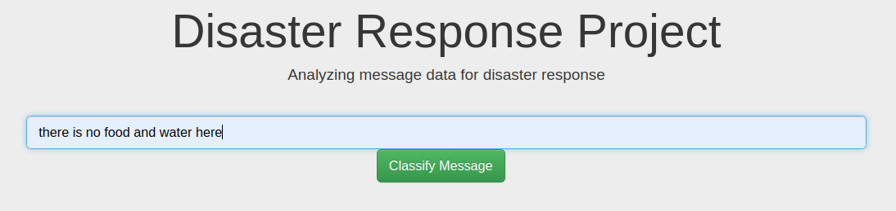
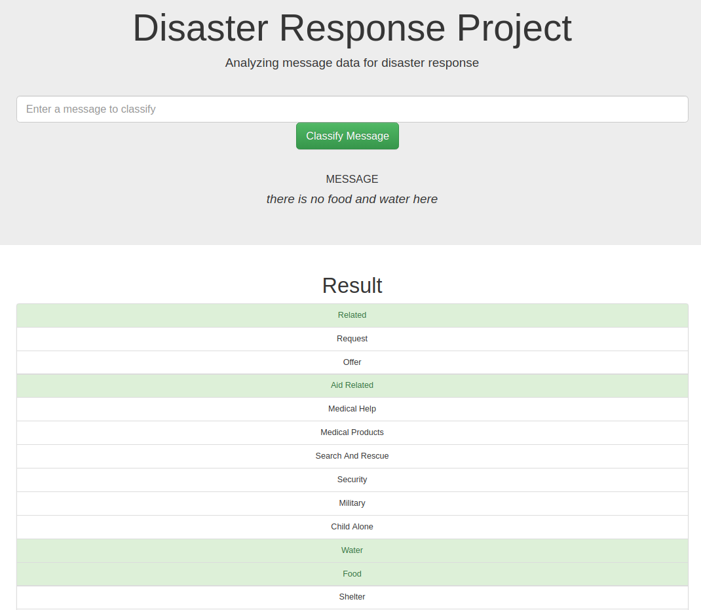
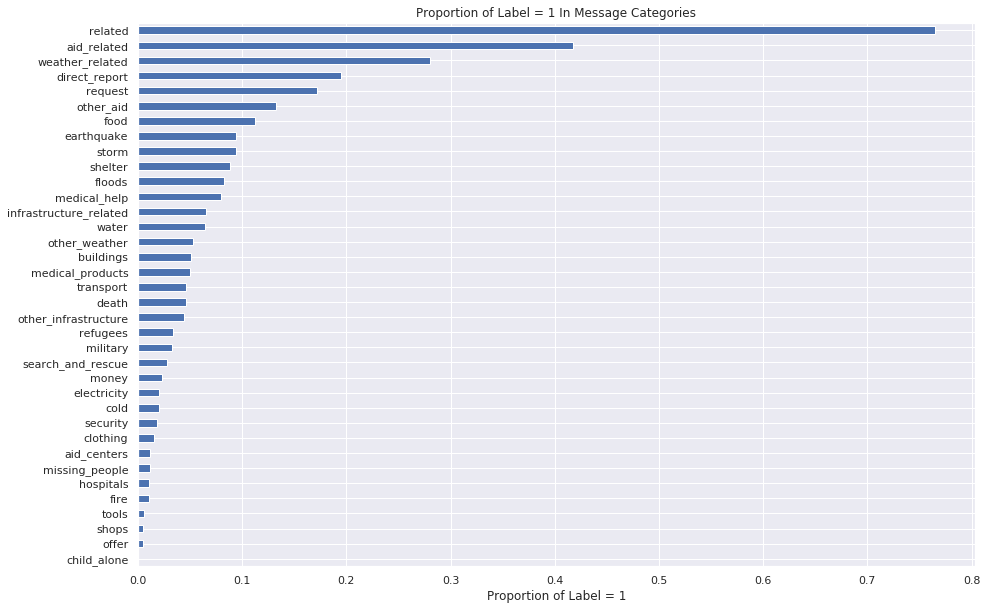

# Disaster Response Pipeline Project 
### (Udacity Data Scientist Nanodegree)

### Table of Contents:
1. Introduction
2. Dependencies 
3. How to Run The Application

    a.ETL
    
    b.ML Pipeline
    
    c.Web Application
    
4. Inference
5. Analysis Results, Caveat and Improvement Suggestions
6. Acknowledgments 


Preview: 




# 1. Introduction

This project is submitted as a requisite of completing Udacity's Data Scientist Nanodegree. It aims to build an ETL and ML Pipeline for disaster response messages classification. The classifier will later predict the corresponding needs/emergency contained in the message to be further leveraged/forwarded to the appropriate organization(s). 

**Two usecases of the classifier:**
1. Offline batch classification - given a set of disaster response messages, user can know the type and magnitude of issues happening


2. Online text classification - the classifier will also be deployed as a web application to enable user to input a text and get the corresponding labels out immediately. 

#### An example of this classifier running is hosted at: 


# 2. Dependencies

Dependencies are contained in requirements.txt

Install the required packages using:

```bash
$pip install -r requirements.txt
```

# 3. Quickstart 

## NOTE: If this is your first time running, you have to run the ETL part first, the ML Pipeline second, only then you can run the web application code. The web application code depends on the files generated by the ETL and ML pipeline part.


### 3.A ETL 

The script process_data.py will read the message and categories data, merge them, perform cleaning and transformation and ultimately save them into a SQL database file. 

Usage:
```bash
$python process_data.py [path_to_message_file] [path_to_categories_file] [path_to_save_sql_database_file]
```

### 3.B ML Pipeline 

Once the database has been created from the ETL step, you can use the script train_classifier.py to read the SQL database file, and train a MultiOutput classifier (AdaBoost as estimator). Hyperparameter tuning is done via 3-fold cross validation to maximize for recall.

The output model will be saved in the specified directory, and can be loaded to perform inference later on. 

Usage: 
```bash
$python train_classifier.py [path_to_db_file] [path_to_save_model_file]
```

During training, this script will also output the performance of the trained model on the testing data set as follows: 




### 3.C Web Application 

The model will also be deployed as a web application using Flask and Plotly. To initialize the web application: 

```bash
cd ./apps
$python run.py
```

By default, the web application will be running at http://0.0.0.0:3001/


# 4. Inference

Aside from using the standard .predict() method of the model object, the running web application can be used to classify text inputs directly: 

### Input the message in the input box



### Hit the `Classify Message` button to perform inference



# 5. Analysis Result, Caveats and Improvement Suggestions

1. There is a heavy imbalance of classes in some of the message categories as shown below (< 1% of classified message in some of the classes). This serves as the basis as of why Recall is being maximized when hyperparameter tuning is done using cross-validation. 



2. In the `related` class, there is a third value 2 (should be 0 and 1). This is cleaned and removed in the ETL part of the project. 

For some of the classes, getting sufficient is really hard because of the class imbalance aforementioned above. There are few possible ways to improve this: 

3. Get more data in the affected classes 
    
    
4. Among the classes, there will be an order of prioritization based on how urgent the need is (eg. Water take precedence over clothing). Instead of doing multi output classification, it might be better to train individual classifiers and build a collection of individual models, tailored to the high priority issues if scalability becomes an issue. This way, the pipeline and parameter tuning can be tailored towards each cases, and higher recall can be obtained, especially for higher priority type of cases.

# 6. Acknowledgments

- Udacity - for designing the course, the project, and providing the web application codes. 
- FigureEight - for providing the dataset
